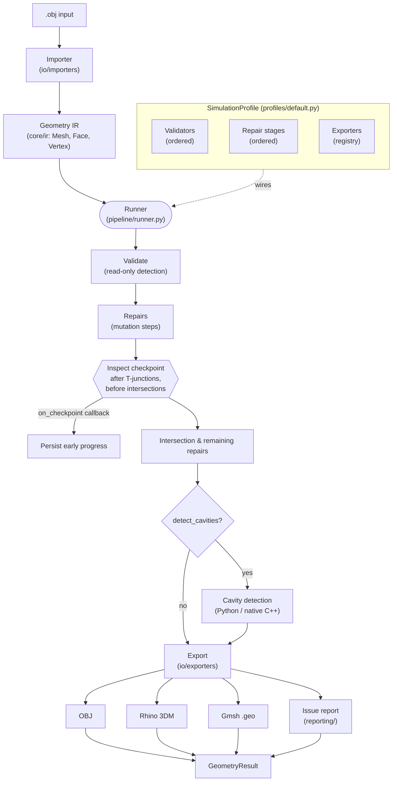

# Geometry Validation & Repair Pipeline

A Python package that runs a **geometry-processing pipeline**. It imports room
geometry from CAD formats, **validates** it for common defects, **repairs**
those defects, and **exports** solver-ready files (OBJ, Rhino 3DM, Gmsh `.geo`)
together with a structured issue report.

The defects it looks for are the ones that matter for **room-acoustics
geometry**, and the main issues are analysed in terms of what **Gmsh** requires
from a mesh (a valid, watertight, non-self-intersecting piecewise-linear
complex): duplicate vertices, zero-area / collinear / small / non-planar faces,
T-junctions, self-intersections, overlapping faces, boundary edges and possible
holes.

The pipeline is organised as **ports-and-adapters**: a small public facade wraps
a registry-driven set of importers, validators, repairs, and exporters that are
wired together by a *profile*.

---

## Installation

Requires **Python ≥ 3.11**.

```powershell
# from the geometry-pipeline/ folder
pip install -e .
```

For development (tests, linting, type checking):

```powershell
pip install -e ".[dev]"
```

Key runtime dependencies (pinned in [pyproject.toml](pyproject.toml)): `numpy`,
`scipy`, `shapely`, `rhino3dm`, `ezdxf`, `trimesh`, `numpy-stl`, `gmsh`,
`meshio`.

> **Native cavity detector (required for cavity detection).** Cavity detection
> uses a C++ kernel under `src/geometry_pipeline/cavity_detection/_native/`. The
> Docker image compiles it and sets `VOLUME_DETECTOR_BIN`. Running with
> `detect_cavities=True` **requires** this binary — if it is missing, cavity
> detection raises a `GeometryError` (there is no automatic fallback). Build the
> native kernel (or set `VOLUME_DETECTOR_BIN`) to enable cavity detection, or
> leave `detect_cavities=False` to skip it. A pure-Python voxel detector exists
> but is only used for testing via an explicit `detection_mode="voxel"`.

---

## Usage

The **only** supported public surface is the facade in
`geometry_pipeline` / `geometry_pipeline.api` (everything else is an
implementation detail). It re-exports `repair_geometry`, `process_geometry`,
`list_issue_kinds`, `GeometryResult`, `IssueInfo`, `GeometryError` and
`SUPPORTED_INPUTS`.

Supported input format: **`.obj`** (`geometry_pipeline.SUPPORTED_INPUTS`).
Rhino `.3dm` and Gmsh `.geo` are **output** formats only.

### Repair + export

```python
from geometry_pipeline import repair_geometry

result = repair_geometry(
    input_path="room.obj",
    output_dir="out/",
    volume_name="RoomVolume",
    detect_cavities=True,  # emit one Gmsh volume per enclosed region
)

print(result.issue_count)  # total detected issues (initial pass)
print(result.outputs)  # {"obj": "out/room.obj", "geo": "out/room.geo", ...}
print(result.report)  # {"pre": {...}, "post": {...}, "repairs": {...}}
```

`repair_geometry` runs the merged default profile in a single pass and returns a
`GeometryResult` describing the *initial* detection. Its sibling
`process_geometry` runs the same pipeline but reports the *repaired* (remaining)
state and accepts an optional `on_checkpoint` callback that fires once at the
inspect checkpoint (after T-junctions are fixed, before intersection repair) so
callers can persist early progress:

```python
from geometry_pipeline import process_geometry

result = process_geometry(
    input_path="room.obj",
    output_dir="out/",
    on_checkpoint=lambda cp: print(cp["stage"], cp["issue_count"]),
)
```

Both functions return a `GeometryResult`:

| Field          | Meaning                                                       |
| -------------- | ------------------------------------------------------------- |
| `outputs`      | `dict[str, str]` of exporter name → written file path         |
| `issue_report` | frontend-shaped issue dict (mapping of issue-kind → entries)  |
| `report`       | `{pre, post, repairs}` snapshot across the run                |
| `issue_count`  | total number of detected issues                               |

All failures are raised as a single `GeometryError`.

### Listing what the pipeline can detect

```python
from geometry_pipeline import list_issue_kinds

for info in list_issue_kinds():
    print(info.kind, "-", "repairable" if info.repairable else "detect-only")
```

Each `IssueInfo` carries the issue `kind`, a short `description`, and whether a
repair step in the pipeline can fix it. `repairable` is derived dynamically from
the `handles` sets declared by the repair steps, so it never drifts from the
actual implementation.

---

## Pipeline overview



The **profile** (`profiles/default.py`) is the single source of truth for *what*
runs and *in what order*: it holds the ordered validators, the repair stages
(including the inspect checkpoint), and the exporter registry. The **runner**
(`pipeline/runner.py`) is generic — it just executes whatever profile it is
given against the imported geometry in a single merged pass.

---

## Folder structure

```
geometry-pipeline/
├─ pyproject.toml              # packaging, deps, pytest config
├─ Dockerfile                  # multi-stage build (compiles native kernel)
├─ src/geometry_pipeline/
│  ├─ api.py                   # PUBLIC facade: repair_geometry / process_geometry / list_issue_kinds
│  ├─ __init__.py              # re-exports the facade
│  ├─ py.typed                 # PEP 561 type marker
│  ├─ core/                    # domain layer (stdlib only)
│  │  ├─ ir.py                 #   geometry IR: Mesh, Face, Vertex, Cavity, …
│  │  ├─ issues.py             #   Issue, IssueKind, DetectionStage
│  │  ├─ profile.py            #   SimulationProfile + Stage dataclasses
│  │  ├─ tolerances.py         #   numeric thresholds / caps
│  │  ├─ context.py            #   per-run Context (tolerances, logger)
│  │  ├─ report.py             #   ValidationSnapshot / RepairResult / RepairReport / PipelineResult
│  │  ├─ diff.py               #   SnapshotDiff: compare two validation snapshots by Issue.id
│  │  └─ jsonable.py           #   coerce numpy scalars/arrays → native JSON types
│  ├─ io/                      # adapters (registry-based)
│  │  ├─ registry.py           #   ImporterRegistry / ExporterRegistry
│  │  ├─ importers/            #   obj
│  │  └─ exporters/            #   obj, 3dm, gmsh .geo
│  ├─ validators/              # detection (read-only)
│  │  ├─ base.py               #   Validator protocol + BaseValidator
│  │  └─ mesh/                 #   mesh-specific validators + _common helpers
│  ├─ repairs/                 # mutation steps
│  │  ├─ base.py               #   RepairStep protocol + BaseRepair
│  │  └─ mesh/                 #   mesh-specific repairs + _common helpers
│  ├─ profiles/                # explicit stage wiring
│  │  └─ default.py            #   default profile (single merged pass)
│  ├─ pipeline/runner.py       # executes a profile against geometry
│  ├─ conversion/              # IR ↔ IR converters (registry; add per-kind converters here)
│  ├─ cavity_detection/        # enclosed-region detection (Python + native C++)
│  ├─ geometry_math/           # pure geometric predicates / triangulation
│  └─ reporting/               # Issue → frontend JSON translation + writers
└─ tests/
```

**Layering rule:** `core/` depends on nothing but the stdlib. Validators and
repairs are split by **geometry kind** (currently only `mesh/`). Each
validator/repair declares `accepts = {"mesh"}`, and a profile's `__post_init__`
rejects any component whose `accepts` doesn't match its `target_ir.kind`.

---

## Testing

Install the dev extras (`pip install -e ".[dev]"`), then from the
`geometry-pipeline/` folder run the full suite:

```powershell
python -m pytest
```

### Public model report regression test

`tests/integration/test_public_model_reports.py` runs the pipeline over every
committed room model under `tests/models/public/NN_<name>/` and asserts the
freshly produced `<name>_inspect_issue.json` and `<name>_remaining_issue.json`
reports match the reference reports in that folder. Run it on its own with:

```powershell
python -m pytest tests/integration/test_public_model_reports.py -v
```

After the run it writes a per-model coverage report (initial vs. remaining
issues detected in the fresh run, plus whether they matched the reference) to a
git-ignored file at `test-results/public_model_coverage.json`:

```json
{
  "01_Apartment_Room": {
    "initial_issue_detected": { "duplicate_vertex": 2, "boundary_edge": 17, "...": 0 },
    "remaining_issue_detected": { "duplicate_vertex": 0, "boundary_edge": 16, "...": 0 },
    "match_with_reference": true
  }
}
```

Adding a new `02_<name>/` folder (its `.obj` plus the two reference JSON files)
is picked up automatically as an additional case — no code changes required.

## Contributing & development

To extend the pipeline (adding a validator, repair, or exporter), understand the
IR model, or run the tests / linters, see the
[contribution & development guide](CONTRIBUTING.new.md).

## License

MIT — see [LICENSE](../LICENSE).
